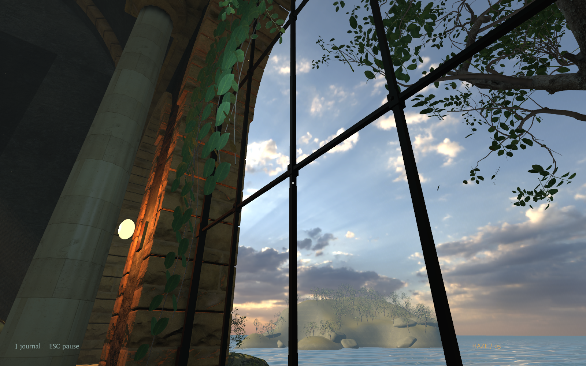
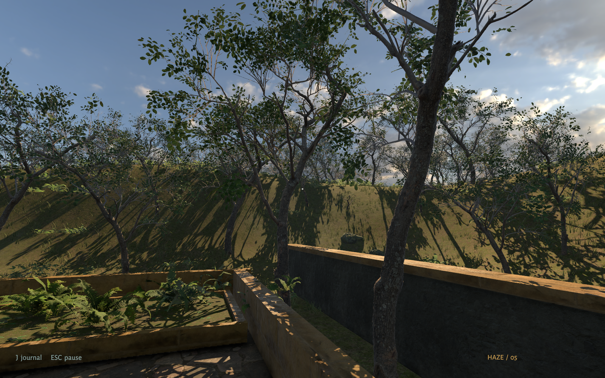

# Haze

A first-person mystery in an abandoned coastal bathhouse. Read the keeper’s papers, restore water, voice, and light, and open the garden. There is no combat or timer.

[Download Haze 0.2.0](https://github.com/gazhenko/haze/releases/tag/v0.2.0)

## Download and play

Choose the archive for your computer under the GitHub release’s **Assets**. Extract the whole archive before launching. Keep the executable, data folder, and libraries together.

| Computer | Download | Launch | Verification |
| --- | --- | --- | --- |
| Windows, Intel/AMD 64-bit | [Windows-x64.zip](https://github.com/gazhenko/haze/releases/download/v0.2.0/Haze-v0.2.0-Windows-x64.zip) | Open `Haze.exe` | Built successfully; runtime unverified |
| Mac, Apple Silicon or Intel | [macOS-universal.zip](https://github.com/gazhenko/haze/releases/download/v0.2.0/Haze-v0.2.0-macOS-universal.zip) | Open `Haze.app` | Native walkthrough on Apple Silicon; Intel unverified |
| Linux, Intel/AMD 64-bit | [Linux-x64.tar.gz](https://github.com/gazhenko/haze/releases/download/v0.2.0/Haze-v0.2.0-Linux-x64.tar.gz) | Run `./play.sh` | Native walkthrough on Omarchy with Vulkan |

Use a keyboard and mouse. The Mac app uses Metal. Windows defaults to Direct3D 11. Linux defaults to Vulkan. These are desktop builds; ARM Windows/Linux and mobile devices are not included.

### First launch on Mac

Move `Haze.app` to Applications if you want to keep it there. This preview has an ad-hoc signature and is not Apple-notarized. If macOS blocks it, first try opening it, then use **System Settings → Privacy & Security → Open Anyway** for Haze. Follow [Apple’s instructions](https://support.apple.com/102445) and only approve the copy obtained from this release.

### First launch on Windows

The Windows preview is unsigned and has not been played on a Windows machine yet. Windows may show an unfamiliar-app prompt. Report launch or graphics problems with your Windows version, graphics card, and `%USERPROFILE%\AppData\LocalLow\Light Studies\Haze\Player.log`.

### Linux

Extract with your archive manager or `tar -xzf Haze-*-Linux-x64.tar.gz`. Open the extracted folder in a terminal and run `./play.sh`. The archive preserves executable permissions; if your extraction tool changes them, run `chmod +x play.sh Haze.x86_64` first.

## Controls

| Control | Action |
| --- | --- |
| WASD / mouse | Walk / look |
| E or left click | Read, ring, or turn |
| Q | Turn a valve or mirror backwards |
| Shift | Walk faster |
| J or Tab | Journal and optional hints |
| Escape | Settings, save and quit, or return to a clear path |
| F12 | Save a photograph |

For a guided visit, press **Escape → Developer guide: ON**. It gives directions and exact puzzle inputs. It is off by default.

## Saves and updates

Progress saves automatically. Replacing the extracted game folder preserves your visit. Saves live separately under the original internal name:

- Windows: `%USERPROFILE%\AppData\LocalLow\Light Studies\The House That Remembers`
- Mac: `~/Library/Application Support/Light Studies/The House That Remembers`
- Linux: `~/.config/unity3d/Light Studies/The House That Remembers`

`remembered-house.json` contains progress; `.bak` is the previous save; `settings.json` contains preferences. Photographs are in `Captures`.

## Verify a download

The release includes `SHA256SUMS`. Compare your archive’s SHA-256 with its listed value:

- Windows PowerShell: `Get-FileHash .\Haze-*-Windows-x64.zip -Algorithm SHA256`
- Mac: `shasum -a 256 Haze-*-macOS-universal.zip`
- Linux: `sha256sum Haze-*-Linux-x64.tar.gz`

Each extracted package also contains checksums for its contents. See [validation results](VALIDATION.md) for the tested hardware and remaining gaps.

## Credits

Built with Unity and the Universal Render Pipeline. Photographed materials, the sky, and source botanical models come from Poly Haven under CC0. Source links and font licenses are in `Credits`. The architecture, story, mechanisms, interface, procedural environment additions, and synthesized bells were made for Haze.
