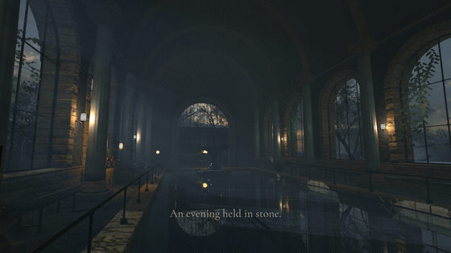
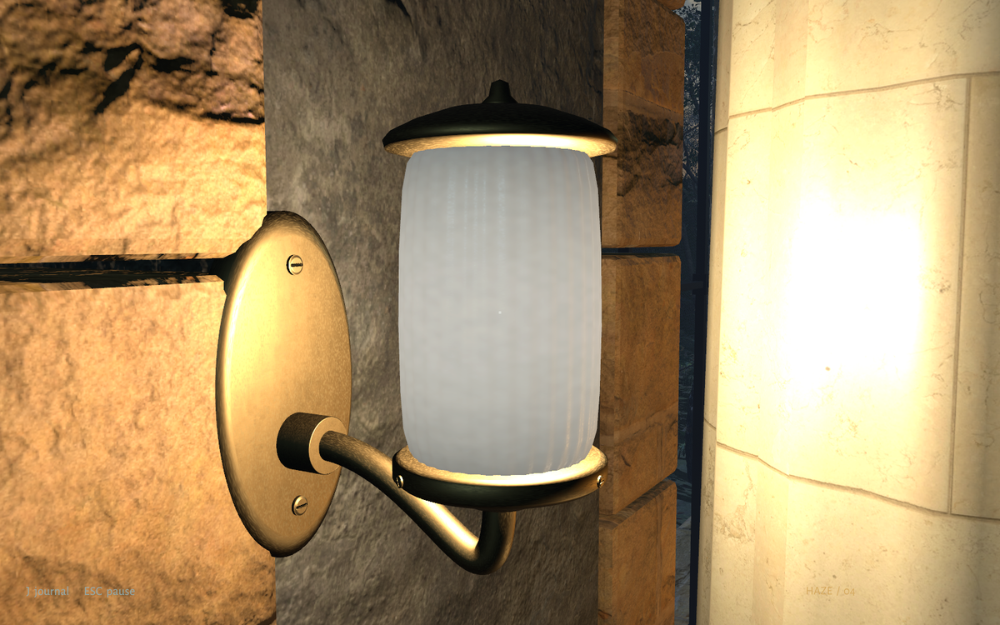
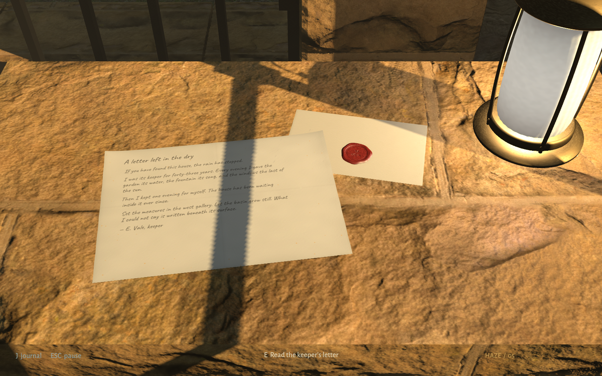
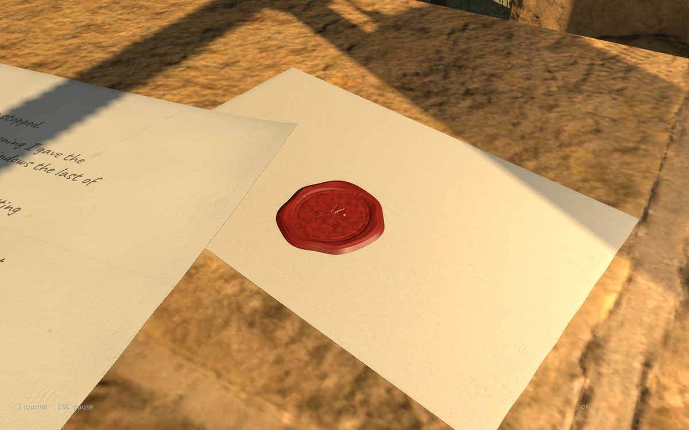
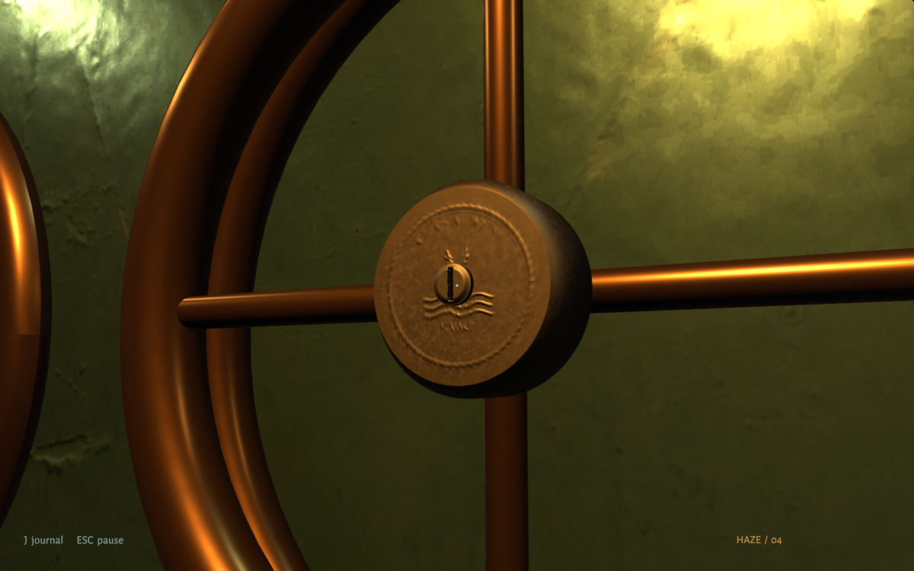
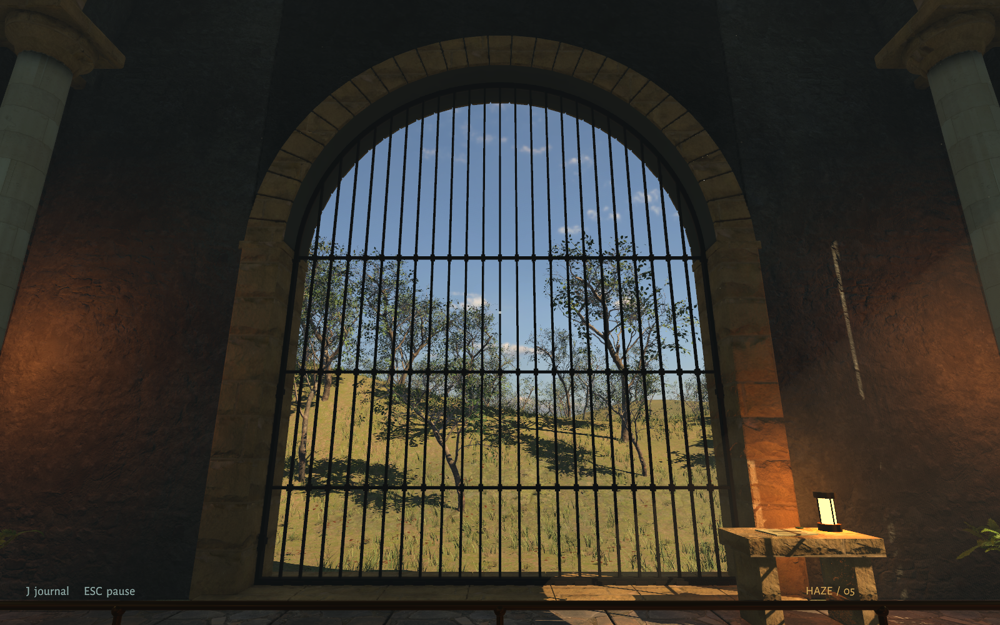

# Haze

A first-person mystery in an abandoned coastal bathhouse. Read the keeper’s papers, restore water, voice, and light, and open the garden. There is no combat or timer.

[Download Haze 0.3.2](https://github.com/gazhenko/haze/releases/tag/v0.3.2) · [Install with your agent](#give-this-to-your-agent)

## Trailer

[](https://github.com/gazhenko/haze/releases/download/v0.3.2/Haze-v0.3.2-Trailer.mp4)

[Watch or download the full 42-second trailer](https://github.com/gazhenko/haze/releases/download/v0.3.2/Haze-v0.3.2-Trailer.mp4) · 1080p · sound on

## Lamps and keeper papers

The small lights now have fluted opal glass, fitted brass seats, curved support arms, and slotted fasteners. Softer warm white light preserves the surface detail.



The keeper’s letters carry their full handwritten text on thin folded paper. Their envelopes have poured wax seals with recessed stamps, and the manifold discs have machined edges and raised keeper crests.







## Environment update

Entrance ironwork now sits in a continuous stone threshold and reaches a fitted arch frame. The garden fanlight has a fixed transom anchored into the stone, so opening the doors leaves it supported.



Window ironwork sits in dressed coping over continuous masonry and foundations. Coastal banks have photographed grasses, ferns, sorrel, moss, fallen leaves, and branch debris.


## Download and play

Choose the archive for your computer under the GitHub release’s **Assets**. Extract the whole archive before launching. Keep the executable, data folder, and libraries together.

| Computer | Download | Launch | Verification |
| --- | --- | --- | --- |
| Windows, Intel/AMD 64-bit | [Windows-x64.zip](https://github.com/gazhenko/haze/releases/download/v0.3.2/Haze-v0.3.2-Windows-x64.zip) | Open `Haze.exe` | Built successfully; runtime unverified |
| Mac, Apple Silicon or Intel | [macOS-universal.zip](https://github.com/gazhenko/haze/releases/download/v0.3.2/Haze-v0.3.2-macOS-universal.zip) | Open `Haze.app` | Native walkthrough on Apple Silicon; Intel unverified |
| Linux, Intel/AMD 64-bit | [Linux-x64.tar.gz](https://github.com/gazhenko/haze/releases/download/v0.3.2/Haze-v0.3.2-Linux-x64.tar.gz) | Run `./play.sh` | Native walkthrough on Omarchy with Vulkan |

Use a keyboard and mouse. The Mac app uses Metal. Windows defaults to Direct3D 11. Linux defaults to Vulkan. These are desktop builds; ARM Windows/Linux and mobile devices are not included.

### Give this to your agent

To have a coding agent such as Claude Code, Codex, or Cursor install Haze, paste this into it:

```text
Install Haze 0.3.2 on this computer from its official GitHub release, then tell me how to start it.

Release: https://github.com/gazhenko/haze/releases/tag/v0.3.2
Download each file from https://github.com/gazhenko/haze/releases/download/v0.3.2/<file>
  macOS, Apple Silicon or Intel  Haze-v0.3.2-macOS-universal.zip  extracts to Haze-macOS-universal/Haze.app
  Windows 10/11, x64             Haze-v0.3.2-Windows-x64.zip      extracts to Haze-Windows-x64/Haze.exe
  Linux, x64                     Haze-v0.3.2-Linux-x64.tar.gz     extracts to Haze-Linux-x64/play.sh
  Checksums                      SHA256SUMS

1. Detect the OS and CPU. If this computer is not one of the three platforms above (for example Windows or Linux on ARM), stop and tell me.
2. Check there are at least 3 GB free. Download the matching archive (about 1.3 GB) and SHA256SUMS into a temporary folder with curl -L (curl.exe on Windows).
3. Compute the archive's SHA-256 and compare it with its line in SHA256SUMS. If it does not match, delete the download and stop.
4. Extract the whole archive (ditto -x -k on macOS, tar -xzf on Linux, Expand-Archive or tar -xf on Windows). The extracted folder has its own SHA256SUMS listing every file relative to that folder; check them all (shasum -a 256 -c SHA256SUMS on macOS, sha256sum -c SHA256SUMS on Linux, Get-FileHash on Windows). If any file fails, stop and tell me.
5. Install it, replacing any earlier Haze install at the same location. Saves are stored in a separate folder, so they are kept.
   - macOS: move Haze.app to ~/Applications/Haze.app. The app is ad-hoc signed and not notarized; if it carries a com.apple.quarantine attribute, remove it with xattr -dr com.apple.quarantine on the app.
   - Windows: move the Haze-Windows-x64 folder to %LOCALAPPDATA%\Programs\Haze. Keep Haze.exe, Haze_Data and the libraries together. Add a Start menu shortcut named "Haze" that points at Haze.exe.
   - Linux: move the Haze-Linux-x64 folder to ~/Games/Haze. If the executable bits were lost, run chmod +x play.sh Haze.x86_64. Add ~/.local/share/applications/haze.desktop with Exec set to that folder's play.sh, Path set to the folder, and Icon set to its icon.png. Haze needs Vulkan drivers.
6. Delete the downloaded archive, SHA256SUMS, and anything left over from extraction.
7. Do not change system-wide security settings (Gatekeeper, SmartScreen, antivirus), and do not run anything else from the archive. Do not launch the game unless I ask. Finish by telling me where it is installed, how to start it, and that it is played with a keyboard and mouse.
```

### First launch on Mac

Move `Haze.app` to Applications if you want to keep it there. This preview has an ad-hoc signature and is not Apple-notarized. If macOS blocks it, first try opening it, then use **System Settings → Privacy & Security → Open Anyway** for Haze. Follow [Apple’s instructions](https://support.apple.com/102445) and only approve the copy obtained from this release.

### First launch on Windows

The Windows preview is unsigned and has not been played on a Windows machine yet. Windows may show an unfamiliar-app prompt. Report launch or graphics problems with your Windows version, graphics card, and `%USERPROFILE%\AppData\LocalLow\Light Studies\Haze\Player.log`.

### Linux

Extract with your archive manager or `tar -xzf Haze-*-Linux-x64.tar.gz`. Open the extracted folder in a terminal and run `./play.sh`. The archive preserves executable permissions; if your extraction tool changes them, run `chmod +x play.sh Haze.x86_64` first.


## Controls

| Control | Action |
| --- | --- |
| WASD / mouse | Walk / look |
| E or left click | Read, ring, or turn |
| Q | Turn a valve or mirror backwards |
| Shift | Walk faster |
| J or Tab | Journal and optional hints |
| Escape | Settings, save and quit, or return to a clear path |
| F12 | Save a photograph |

For a guided visit, press **Escape → Developer guide: ON**. It gives directions and exact puzzle inputs. It is off by default.

## Saves and updates

Progress saves automatically. Replacing the extracted game folder preserves your visit. Saves live separately under the original internal name:

- Windows: `%USERPROFILE%\AppData\LocalLow\Light Studies\The House That Remembers`
- Mac: `~/Library/Application Support/Light Studies/The House That Remembers`
- Linux: `~/.config/unity3d/Light Studies/The House That Remembers`

`remembered-house.json` contains progress; `.bak` is the previous save; `settings.json` contains preferences. Photographs are in `Captures`.

## Verify a download

The release includes `SHA256SUMS`. Compare your archive’s SHA-256 with its listed value:

- Windows PowerShell: `Get-FileHash .\Haze-*-Windows-x64.zip -Algorithm SHA256`
- Mac: `shasum -a 256 Haze-*-macOS-universal.zip`
- Linux: `sha256sum Haze-*-Linux-x64.tar.gz`

Each extracted package also contains checksums for its contents. See [validation results](VALIDATION.md) for the tested hardware and remaining gaps.

## Credits

Built with Unity and the Universal Render Pipeline. Photographed materials, the sky, and source botanical models come from Poly Haven under CC0. Small prop materials also use CC0 assets from [ambientCG](https://ambientcg.com), with original aging, glass, wax, and token detail. The letter handwriting uses Caveat under the SIL Open Font License. Source links and font licenses are in `Credits`. The architecture, story, mechanisms, interface, procedural environment additions, and synthesized bells were made for Haze.
